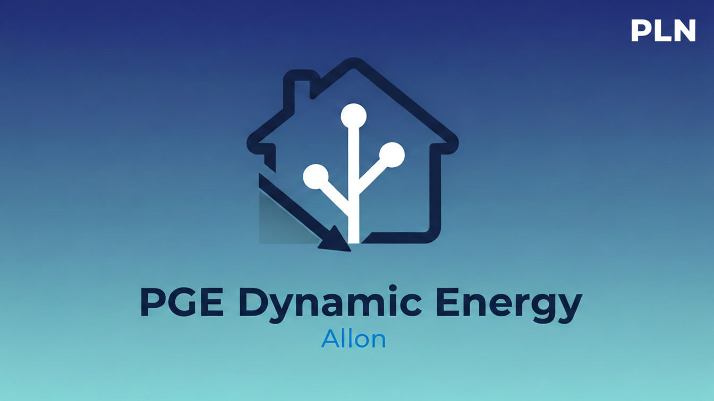

# ⚡ PGE Dynamic Energy dla Home Assistant
### Przestań przepłacać za prąd. Automatyzuj dom w oparciu o realne ceny rynkowe PGE.

**Idealne dla posiadaczy magazynów energii, samochodów elektrycznych oraz każdego, kto chce obniżyć rachunki za energię.**


[](https://my.home-assistant.io/redirect/hacs_repository/?owner=AllonGit&repository=ha_pge_dynamic&category=integration)

## 🌍 Language / Język

<details>
<summary><b>Click here for English version</b></summary>

Integration that fetches current electricity prices (Balancing Market) directly from the official PGE DataHub API. This tool allows you to monitor market rates in real-time directly within your Home Assistant dashboard.

<p align="center">  </p>

## 🌟 Main Features
* **UI Configuration:** Simple integration setup via the Home Assistant interface (Config Flow).

* **Net Price:** Displays the current market rate in PLN/kWh.

* **Accuracy:** Data fetched from the Fix_1 contract (Balancing Market).

* **Full Day Coverage:** 24 separate hourly sensors (from 00:00 to 23:00).

* **Current Sensor:** sensor.pge_cena_aktualna – price for the current hour.

Optimization: Uses DataUpdateCoordinator for minimal system load.

## 🚀 Installation
Via HACS (Recommended)
In Home Assistant, go to HACS -> Integrations.

Click the three dots in the top right corner and select Custom repositories.

Paste this repository URL: https://github.com/AllonGit/ha_pge_dynamic

Select the Integration category and click Add.

Find the integration in the list, click Download, and then restart Home Assistant.

## ⚙️ Configuration
Go to Settings -> Devices & Services.

Click Add Integration and search for PGE Dynamic Energy.

Enter a name and select your tariff (e.g., G1x).

## 💰 How to add costs to the Energy Dashboard?
The integration is fully compatible with the official **Energy Dashboard**. To see your spending in your local currency:
1. Go to the **Energy** tab in Home Assistant.
2. Click the **three dots** in the top right corner and select **Edit dashboard** (pencil icon).
3. In the **Electricity grid** section, click the **pencil icon** next to your main energy consumption sensor.
4. Select the option **"Use an entity with current price"**.
5. Search for and select: `sensor.pge_cena_aktualna`.
6. Click **Save**.

> **Tip:** Cost calculations will start appearing in the dashboard after approximately 1-2 hours.

## 📊 Charts (ApexCharts)
Example configuration for ApexCharts Card (displays hourly prices for the entire day):

```yaml
type: custom:apexcharts-card
update_interval: 1min
header:
  show: true
  title: Ceny Energii PGE (Netto)
  show_states: true
graph_span: 24h
span:
  start: day
yaxis:
  - decimals: 3
series:
  - entity: sensor.pge_cena_aktualna
    show:
      in_chart: false
      in_header: true
    name: "Cena Aktualna"
    float_precision: 3

  - entity: sensor.pge_cena_aktualna
    type: column
    color: "#ff9800"
    float_precision: 3
    show:
      in_header: false
      legend_value: false
    data_generator: |
      const prices = [];
      const today = new Date();
      today.setHours(0, 0, 0, 0);
      for (let i = 0; i < 24; i++) {
        const hourStr = i.toString().padStart(2, '0');
        const entityId = `sensor.pge_cena_${hourStr}_00`;
        const stateObj = hass.states[entityId];
        if (stateObj) {
          const timestamp = new Date(today).setHours(i, 0, 0, 0);
          prices.push([timestamp, parseFloat(stateObj.state)]);
        }
      }
      return prices;
```


## 💡 Example Automations
Below you will find ready-to-use codes that you can copy to your Home Assistant (Settings -> Automations -> Create new -> Edit in YAML).

#### Automation: START charging
```yaml

alias: "Storage - Start charging"
description: "Turns on grid charging when the price is low"
trigger:
  - platform: numeric_state
    entity_id: sensor.pge_cena_aktualna
    below: 0.45                        # Price at which we start (e.g., 0.45 PLN)
action:
  - action: switch.turn_on
    target:
      entity_id: switch.deye_grid_charge # Your inverter charging switch
  - action: notify.mobile_app_your_phone
    data:
      title: "🔋 Storage charging started"
      message: "Price dropped to {{ states('sensor.pge_cena_aktualna') }} PLN. Starting storage charging."
mode: single
```
#### Automation: STOP charging

```yaml
alias: "Storage - Stop charging"
description: "Turns off grid charging when the price rises"
trigger:
  - platform: numeric_state
    entity_id: sensor.pge_cena_aktualna
    above: 0.55                        # Price above which we stop (e.g., 0.55 PLN)
action:
  - action: switch.turn_off
    target:
      entity_id: switch.deye_grid_charge # Your inverter charging switch
  - action: notify.mobile_app_your_phone
    data:
      title: "💰 Charging finished"
      message: "Price rose to {{ states('sensor.pge_cena_aktualna') }} PLN. Stopping grid charging."
mode: single
```
#### Automation: Phone Notification

```yaml
alias: "Storage - Notification Only"
description: "Sends info about cheap energy without inverter interference"
trigger:
  - platform: numeric_state
    entity_id: sensor.pge_cena_aktualna
    below: 0.45                        # Price threshold for notification
action:
  - action: notify.mobile_app_your_phone
    data:
      title: "🔋 Warning! Cheap energy"
      message: "Price dropped to {{ states('sensor.pge_cena_aktualna') }} PLN. You can manually start charging."
mode: single
```

## 💬 Community and Support
Do you have questions, ideas for new features, or want to show off your dashboard?
* 🏠 **Forum:** Join the discussion on the [ArturHome Forum](https://forum.arturhome.pl/t/integracja-ceny-dynamiczne-pge/16152/10).
* ⭐ **GitHub:** If this integration helps you, please leave a Star – it keeps me motivated to keep developing!
* **Community Standards:** We follow the rules of the [CODE_OF_CONDUCT.md](CODE_OF_CONDUCT.md).

## 🗺️ Roadmap

<details>
<summary><b>Click for Road map</b></summary>

| Version | Stage | Key Features |
| :--- | :--- | :--- |
| **v1.2.0** | **Data Management** | Next-day forecasting (DAM), tariff profiles (G1x/G12), min/max price entities. |
| **v1.2.1** | **Real-Cost Calc** | Gross multiplier (VAT + fees) configurable via UI. |
| **v1.3.0** | **Automation** | "Price Window" binary sensor (automatic detection of cheapest hours). |
| **v1.4.0** | **Notifications** | Ready-to-use Blueprints for Push and TTS notifications. |
| **v1.5.0** | **Reporting** | Savings statistics module vs. traditional flat-rate tariffs. |
| **v1.6.x+** | **Intelligence** | Forecast.Solar synergy (PV production-based optimization). |

</details>

## ❓ Troubleshooting
Status unavailable:
The PGE DataHub API updates data at specific times. If the sensor has no data, check Settings -> System -> Logs. Look for entries related to pge_dynamic.

Important Price Information
The price in the integration is the net price of raw energy (Balancing Market). Remember that your final bill additionally includes:

* Taxes (VAT, excise).

* Distribution fees (variable and fixed).

## ⚖️ License & Disclaimer
Project released under the MIT License.

Legal Note: This integration is open-source and for hobbyist use. Data is fetched from the publicly available PGE DataHub API. The author is not responsible for any data errors or financial decisions made based on this information. Always verify data with your energy provider.

</details>

Integracja pobierająca aktualne ceny energii elektrycznej (Rynek Bilansujący) bezpośrednio z oficjalnego API **PGE DataHub**. Narzędzie pozwala na monitorowanie stawek rynkowych w czasie rzeczywistym bezpośrednio w Twoim panelu Home Assistant.

<p align="center">
  
</p>

## 🌟 Główne Funkcje

* **Konfiguracja przez UI:** Proste dodawanie integracji przez interfejs Home Assistant (Config Flow).
* **Cena Netto:** Wyświetla aktualną stawkę rynkową w **PLN/kWh**.
* **Dokładność:** Dane pobierane z kontraktu Fix_1 (Rynek Bilansujący).
* **Kompletna doba:** 24 odrębne sensory godzinne (od `00:00` do `23:00`).
* **Sensor bieżący:** `sensor.pge_cena_aktualna` – cena dla obecnej godziny.
* **Optymalizacja:** Używa `DataUpdateCoordinator` dla minimalnego obciążenia systemu.

## 🚀 Instalacja

### Przez HACS (Zalecane)

1. W Home Assistant przejdź do **HACS** -> **Integracje**.
2. Kliknij trzy kropki w prawym górnym rogu i wybierz **Custom repositories**.
3. Wklej URL tego repozytorium: `https://github.com/AllonGit/ha_pge_dynamic`
4. Wybierz kategorię **Integration** i kliknij **Dodaj**.
5. Znajdź integrację na liście, kliknij **Pobierz**, a następnie zrestartuj Home Assistant.

## ⚙️ Konfiguracja

1. Przejdź do **Ustawienia** -> **Urządzenia oraz usługi**.
2. Kliknij **Dodaj integrację** i wyszukaj `PGE Dynamic Energy`.
3. Wpisz nazwę oraz wybierz swoją taryfę (np. **G1x**).

## 💰 Jak dodać koszty w panelu Energia?
Integracja jest w pełni kompatybilna z oficjalnym panelem Energia. Aby widzieć wydatki w złotówkach, wykonaj te 4 proste kroki:

Przejdź do zakładki Energia w swoim Home Assistant.

Kliknij Edytuj panel (ikona ołówka).

W sekcji Sieć elektryczna, przy Twoim głównym sensorze poboru energii, kliknij ponownie ikonę ołówka (Edytuj).

Wybierz opcję "Użyj encji z bieżącą ceną" i z listy wybierz sensor:

**sensor.pge_cena_aktualna**

Kliknij Zapisz.

**Wskazówka:** Pierwsze wyliczenia kosztów pojawią się w panelu po około 1-2 godzinach od konfiguracji.

## 📊 Wykresy (ApexCharts)
Przykład konfiguracji dla karty `ApexCharts Card` (wyświetla ceny godzinowe na całą dobę):

```yaml
type: custom:apexcharts-card
update_interval: 1min  # <--- To wymusi aktualizację karty co minutę
header:
  show: true
  title: Ceny Energii PGE (Netto)
  show_states: true
graph_span: 24h
span:
  start: day
yaxis:
  - decimals: 3
series:
  - entity: sensor.pge_cena_aktualna
    show:
      in_chart: false
      in_header: true
    name: "Cena Aktualna"
    float_precision: 3

  - entity: sensor.pge_cena_aktualna
    type: column
    color: "#ff9800"
    float_precision: 3
    show:
      in_header: false
      legend_value: false
    data_generator: |
      const prices = [];
      const today = new Date();
      today.setHours(0, 0, 0, 0);
      for (let i = 0; i < 24; i++) {
        const hourStr = i.toString().padStart(2, '0');
        const entityId = `sensor.pge_cena_${hourStr}_00`;
        const stateObj = hass.states[entityId];
        if (stateObj) {
          const timestamp = new Date(today).setHours(i, 0, 0, 0);
          prices.push([timestamp, parseFloat(stateObj.state)]);
        }
      }
      return prices;
```
## 💡 Przykładowe Automatyzacje

Poniżej znajdziesz gotowe kody, które możesz skopiować do swojego Home Assistant (Ustawienia -> Automatyzacje -> Utwórz nową -> Edytuj w YAML).

#### Automatyzacja:START ładowania

```yaml
alias: "Magazyn - Start ładowania"
description: "Włącza ładowanie z sieci, gdy cena jest niska"
trigger:
  - platform: numeric_state
    entity_id: sensor.pge_cena_aktualna
    below: 0.45                        # Cena od której startujemy (np. 45 gr)
action:
  - action: switch.turn_on
    target:
      entity_id: switch.deye_grid_charge # Przełącznik ładowania w falowniku (podaj switch włączania ładowania z sieci)
  - action: notify.mobile_app_twoj_telefon # Powiadomienie na telefon
    data:
      title: "🔋 Start ładowania magazynu"
      message: "Cena spadła do {{ states('sensor.pge_cena_aktualna') }} PLN. Uruchamiam ładowanie magazynu."
mode: single
```
#### Automatyzacja:STOP ładowania

```yaml
alias: "Magazyn - Stop ładowania"
description: "Wyłącza ładowanie z sieci, gdy cena wzrośnie"
trigger:
  - platform: numeric_state
    entity_id: sensor.pge_cena_aktualna
    above: 0.55                        # Cena powyżej której kończymy (np. 55 gr)
action:
  - action: switch.turn_off
    target:
      entity_id: switch.deye_grid_charge # Przełącznik ładowania w falowniku (ten sam co przy starcie)
  - action: notify.mobile_app_twoj_telefon # Powiadomienie na telefon 
    data:
      title: "💰 Koniec ładowania"
      message: "Cena wzrosła do {{ states('sensor.pge_cena_aktualna') }} PLN. Wyłączam ładowanie z sieci."
mode: single
```
#### Automatyzacja: Powiadomienie na telefon

```yaml
alias: "Magazyn - Tylko powiadomienie"
description: "Wysyła info o taniej energii bez ingerencji w falownik"
trigger:
  - platform: numeric_state
    entity_id: sensor.pge_cena_aktualna
    below: 0.45                        # Próg ceny dla powiadomienia (np. 45 gr)
action:
  - action: notify.mobile_app_twoj_telefon # Powiadomienie na telefon (podaj swój serwis)
    data:
      title: "🔋 Uwaga! Tani prąd"
      message: "Cena spadła do {{ states('sensor.pge_cena_aktualna') }} PLN. Możesz ręcznie włączyć ładowanie."
mode: single
```

## 📈 Pomóż w rozwoju projektu
Jeśli korzystasz z tej integracji, proszę rozważ włączenie opcji **Analytics** w ustawieniach Twojego Home Assistant. Dzięki temu będę wiedział, ilu użytkowników korzysta z projektu, co daje mi ogromną motywację do dodawania nowych funkcji (np. wsparcia dla taryf G12/G12w).

## 📸 Podgląd
<p align="center">
  
</p>

## ❓ Rozwiązywanie problemów (Troubleshooting)

#### Status unavailable: 
API PGE DataHub aktualizuje dane o określonych godzinach. Jeśli sensor nie ma danych, sprawdź Ustawienia -> System -> Logi. Szukaj wpisów dotyczących pge_dynamic.

#### Błąd importu w ApexCharts: 
Upewnij się, że zainstalowałeś ApexCharts Card przez HACS.

## Ważna informacja o cenach
Cena w integracji to cena netto czystej energii (Rynek Bilansujący). Pamiętaj, że Twój ostateczny rachunek zawiera dodatkowo:

* **Podatki (VAT, akcyza).**

* **Opłaty dystrybucyjne (zmienne i stałe).**

## Plan rozwoju

<details>
<summary><b>Kliknij, aby rozwinąć plan rozwoju</b></summary>

| Wersja | Etap | Kluczowe funkcje |
| :--- | :--- | :--- |
| **v1.2.0** | **Zarządzanie Danymi** | Prognoza cen na jutro (RDN), profile taryfowe (G1x/G12), encje ceny min/max. |
| **v1.2.1** | **Koszty Realne** | Mnożnik brutto (VAT + opłaty) konfigurowalny w UI. |
| **v1.3.0** | **Automatyzacja** | Binary sensor "Tanie Okno" (automatyczne wykrywanie najtańszych godzin). |
| **v1.4.0** | **Powiadomienia** | Gotowe Blueprints dla powiadomień Push i TTS. |
| **v1.5.0** | **Analityka** | Moduł statystyk i raport oszczędności względem taryf płaskich. |
| **v1.6.x+** | **Inteligencja** | Synergia z Forecast.Solar (optymalizacja pod produkcję PV). |

</details>

## 💬 Społeczność i wsparcie
Masz pytania, pomysły na nowe funkcje lub chcesz pochwalić się swoim dashboardem?
* 🏠 **Forum:** Zapraszam do wątku na forum [ArturHome](https://forum.arturhome.pl/t/integracja-ceny-dynamiczne-pge/16152/10).
* ⭐ **GitHub:** Jeśli integracja Ci pomaga, zostaw proszę gwiazdkę – to motywuje do dalszej pracy!
* **Standardy społeczności:** Obowiązuje nas [CODE_OF_CONDUCT.md](CODE_OF_CONDUCT.md).


## 🤝 Współtworzenie

Chcesz pomóc w rozwoju projektu? Zapraszamy!

* **Masz pomysł lub znalazłeś błąd?** Otwórz [Issue](https://github.com/AllonGit/ha_pge_dynamic/issues).
* **Zasady współpracy:** Sprawdź nasz plik [CONTRIBUTING.md](CONTRIBUTING.md).

## 🛡️ Bezpieczeństwo

Jeśli znalazłeś lukę w bezpieczeństwie, prosimy o zapoznanie się z naszą polityką bezpieczeństwa w pliku [SECURITY.md](SECURITY.md).

## ⚖️ Licencja

Projekt udostępniany na licencji **MIT**. Pełną treść znajdziesz w pliku [LICENSE](LICENSE).

## ⚠️ Nota prawna

Integracja ma charakter open-source i hobbystyczny. Dane są pobierane z publicznie dostępnego API PGE DataHub. Autor nie ponosi odpowiedzialności za ewentualne błędy w danych ani decyzje finansowe podejmowane na ich podstawie. Zawsze weryfikuj dane u dostawcy energii.
